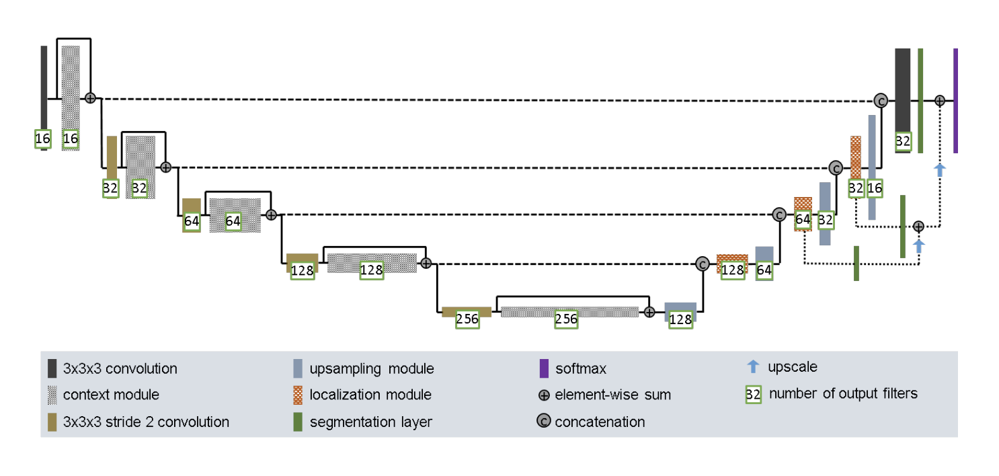
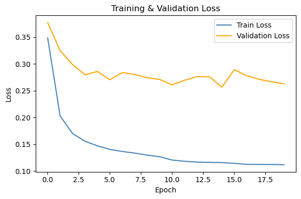
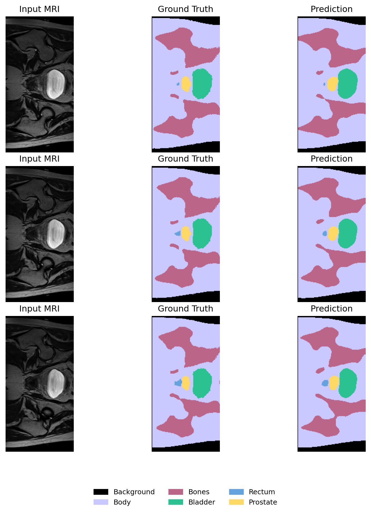
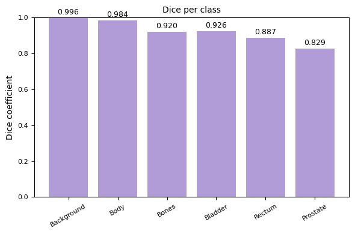

# Improved U-Net for 2D Hip MRI Segmentation

## Problem description
 Manual segmentation in medical imaging is time-consuming, operator-dependent and prone to variability (Yepes-Calderon & McComb, 2019). Automating the process helps improve efficiency and produce more consistent results. This project performs segmentation of 2D prostate MRI slices from the HipMRI Study on Prostate Cancer using an Improved U-Net model. The model is trained to distinguish six anatomical classes: background, body, bones, bladder, rectum and prostate, which are relevant to prostate analysis. The goal was to achieve a Dice similarity coefficient above 0.75 for all classes on the test data, which was successfully met.

## Model description
The model builds upon the U-Net architecture proposed by Ronneberger et al. (2015), which introduced an encoder–decoder structure with skip connections for biomedical image segmentation. This project uses an Improved U-Net inspired by Isensee et al. (2018), which adds changes to improve training stability and segmentation accuracy. 

These changes include using Instance Normalization instead of Batch Normalization so that each slice is normalised on its own, making the model less affected by brightness and contrast differences between scans. Leaky ReLU is used instead of ReLU activations to help prevent inactive neurons. Dropout layers within the convolutional blocks help the model generalise better and reduce overfitting. The model also uses deep supervision, meaning it learns not only from the final output but also from earlier decoder layers. This helps the network capture both small features and larger patterns more effectively.

The model includes four encoder and four decoder levels, each connected by skip connections that transfer spatial information between matching resolutions. Each level uses a pre-activation residual block with two 3×3 convolutional layers, Instance Normalization, Leaky ReLU activations (0.01) and Dropout (0.3). The number of feature channels increases with depth, reaching 256 at the bottleneck, and is then reduced symmetrically during decoding.

The diagram illustrates the encoder–decoder structure of the improved U-Net. The encoder gradually downsamples the input image while extracting important features through convolutional blocks. The decoder upsamples these features back to the original resolution, and combines them with encoder features through skip connections. While the original architecture is designed for 3D MRI data, my model is simplified and adapted for 2D MRI slices.

## Loading and preprocessing
The MRI data and segmentation masks were stored in Nifti (.nii) format and loaded using the nibabel library. Each image–mask pair was read from disk, converted to tensors, resized to 256×128 pixels (as this was the original size of most of the images), and normalised before being passed to the network. Random flips were applied during training for data augmentation. The dataset was already organised into training, validation and test sets. These existing splits were used as they were.

## Training and validation
Training used a combination of Cross-Entropy and Dice loss to ensure both precise pixel classification and good overlap between the predicted and true regions. The Adam optimizer was used with an initial learning rate of 1 × 10⁻⁴, which was halved once after ten epochs using a StepLR scheduler. Training was performed for 20 epochs with a batch size of 4. Validation was done after each epoch on a separate validation set to monitor generalisation and prevent overfitting. 

Throughout training, both training and validation losses were logged. The loss curves below show that the training loss decreased steadily, while the validation loss plateaued after a few epochs with small fluctuations. This indicates stable learning, although the gap between the two suggests that the model’s ability to generalise could potentially improve with stronger regularisation, such as additional data augmentation.

## Results
The trained model generally achieved good segmentation results across all six classes. As shown in the examples below, the predicted masks align well with the ground truth, and accurately outline the shapes of the relevant structures. This indicates that the model successfully learned spatial relationships in the MRI slices.

        

The model achieved high Dice coefficients for all classes, with scores ranging from 0.829 to 0.996. Background and body regions reached nearly perfect overlap, while the prostate showed the lowest score (0.829), likely because of smaller size and less clear boundaries. 

## Dependencies and reproducibility
The model was trained and evaluated on the Rangpur computing cluster provided by UQ using a dedicated Conda environment, with the following dependencies:
- Python 3.13.5
- PyTorch 2.7.1
- torchvision 0.22.1
- nibabel 5.3.2
- numpy 2.1.2
- matplotlib 3.10.6

The code does not use random seeds so results may vary slightly between runs. Run the training script to reproduce the training and evaluation process. Run the prediction script to generate segmentation outputs and compute Dice coefficients on the test MRI slices.

## References
-  Isensee, F.,  Kickingereder, P., Wick, W., Bendszus, M., Maier-Hein, K. (2018) Brain Tumor Segmentation and Radiomics Survival Prediction: Contribution to the BRATS
2017 Challenge. *arXiv preprint.* https://arxiv.org/abs/1802.10508

- Ronneberger, O., Fischer, P., Brox, T. (2015) U-Net: Convolutional Networks for Biomedical Image Segmentation. *arXiv preprint.* https://arxiv.org/abs/1505.04597

- Yepes-Calderon, F., McComb, J. (2019) Manual Segmentation Errors in Medical Imaging. Proposing a Reliable Gold Standard. *Applied Informatics (ICAI 2019).* Springer. https://doi.org/10.1007/978-3-030-32475-9_17